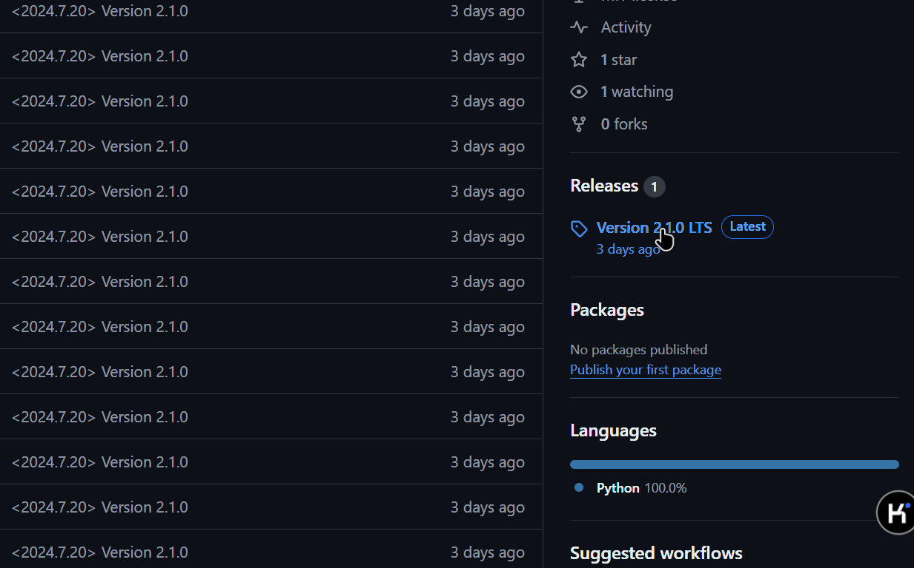
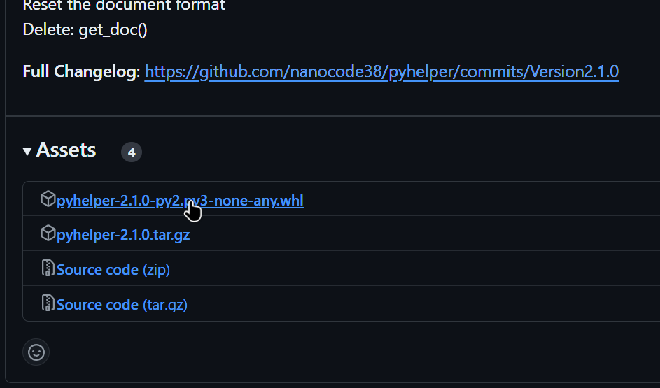

# PyHelper - 一个为Python提供更多辅助工具的包


[英文版本 - English Version](README.md)

这是一个为Python提供更多辅助工具的包

## 下载包

此包暂时没有发布到PyPi(由于名称重名),因此无法使用pip直接下载安装。必须手动下载whl包并安装

首先登录[Github](https://github.com/), 来的[Pyhelper官方网站](https://github.com/pyhelper.git), 然后找到```Releases```一栏，
点击下面的发行版。如图。


然后在```Assets```栏中下载``pyhelper-2.1.0-py2.py3-none-any.whl```， 名称可能因版本而不同， 但一点要以.whl结尾
如图。



下载完成后切换到含有whl文件的目录，运行```pip3 install [Whl文件]```, 把[Whl文件]替换为下载的whl文件名称

*注：若需要在虚拟环境中安装， 记得提前激活虚拟环境！*

这就完成了！

## 贡献

如果您想为PyHelper做出贡献，请查看 https://github.com/nanocode38/pyhelper.git
